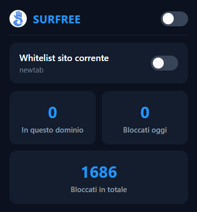

# Surfree

Surfree is a Chrome extension built with JavaScript (Manifest V3) designed to block ads, trackers, and popups.

It utilizes **EasyList** filter rulesets to perform network request filtering.

---

## Installation

To install Surfree as an unpacked extension:

1. Clone this repository: `git clone https://github.com/cristianDemarco/surfree.git`
2. Open Chrome and navigate to `chrome://extensions/`
3. Enable **Developer mode** (toggle in the top right corner)
4. Click **Load unpacked** and select the extension directory

---

## Features

- **Global Toggle:** Turn extension filtering on or off with a single click.
- **Domain Whitelist:** Easily whitelist specific domains using the current-site toggle.
- **Domain Statistics:** Real-time count of blocked items on the active website.
- **Daily Tracker:** Tracks blocked requests for the current day, resetting automatically at midnight.
- **Total Count:** Accumulates total blocks since installation.

---

## Preview

